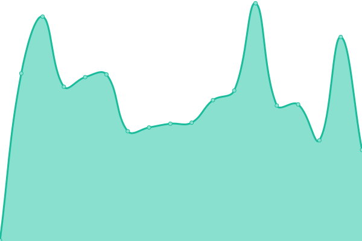

# [📈 Live Status](https://hritikch24.github.io/uptime-testing/): <!--live status--> **🟧 Partial outage**

<!--start: status pages-->
<!-- This summary is generated by Upptime (https://github.com/upptime/upptime) -->
<!-- Do not edit this manually, your changes will be overwritten -->
<!-- prettier-ignore -->
| URL | Status | History | Response Time | Uptime |
| --- | ------ | ------- | ------------- | ------ |
|  [Google](https://www.google.com) | 🟩 Up | [google.yml](https://github.com/hritikch24/uptime-testing/commits/HEAD/history/google.yml) | 

 124ms
     
 | 

<a href="https://hritikch24.github.io/uptime-testing/history/google">100.00%</a>
    

|  [Wikipedia](https://en.wikipedia.org) | 🟩 Up | [wikipedia.yml](https://github.com/hritikch24/uptime-testing/commits/HEAD/history/wikipedia.yml) | 

 126ms
     
 | 

<a href="https://hritikch24.github.io/uptime-testing/history/wikipedia">100.00%</a>
    

|  [Hacker News](https://news.ycombinator.com) | 🟩 Up | [hacker-news.yml](https://github.com/hritikch24/uptime-testing/commits/HEAD/history/hacker-news.yml) | 

 192ms
     
 | 

<a href="https://hritikch24.github.io/uptime-testing/history/hacker-news">100.00%</a>
    

|  [Flush](https://flush.com) | 🟩 Up | [flush.yml](https://github.com/hritikch24/uptime-testing/commits/HEAD/history/flush.yml) | 

 252ms
     
 | 

<a href="https://hritikch24.github.io/uptime-testing/history/flush">100.00%</a>
    

|  [slabs](https://thewearableinternet.com) | 🟩 Up | [slabs.yml](https://github.com/hritikch24/uptime-testing/commits/HEAD/history/slabs.yml) | 

 284ms
     
 | 

<a href="https://hritikch24.github.io/uptime-testing/history/slabs">100.00%</a>
    

|  [Test Broken Site](https://thissitedoesnotexist.koj.co) | 🟥 Down | [test-broken-site.yml](https://github.com/hritikch24/uptime-testing/commits/HEAD/history/test-broken-site.yml) | 

 0ms
     
 | 

<a href="https://hritikch24.github.io/uptime-testing/history/test-broken-site">100.00%</a>
    

<!--end: status pages-->

[**Visit our status website →**](https://hritikch24.github.io/uptime-testing)

