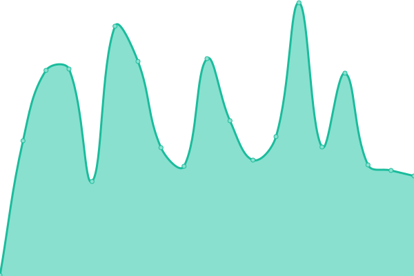

# [📈 Live Status](https://hritikch24.github.io/uptime-testing/): <!--live status--> **🟩 All systems operational**

<!--start: status pages-->
<!-- This summary is generated by Upptime (https://github.com/upptime/upptime) -->
<!-- Do not edit this manually, your changes will be overwritten -->
<!-- prettier-ignore -->
| URL | Status | History | Response Time | Uptime |
| --- | ------ | ------- | ------------- | ------ |
|  [Flush](https://flush.com) | 🟩 Up | [flush.yml](https://github.com/hritikch24/uptime/commits/HEAD/history/flush.yml) | 

 244ms
     
 | 

<a href="https://hritikch24.github.io/uptime/history/flush">100.00%</a>
    

|  [slabs](https://thewearableinternet.com) | 🟩 Up | [slabs.yml](https://github.com/hritikch24/uptime/commits/HEAD/history/slabs.yml) | 

 279ms
     
 | 

<a href="https://hritikch24.github.io/uptime/history/slabs">100.00%</a>
    

<!--end: status pages-->

[**Visit our status website →**](https://hritikch24.github.io/uptime-testing)
